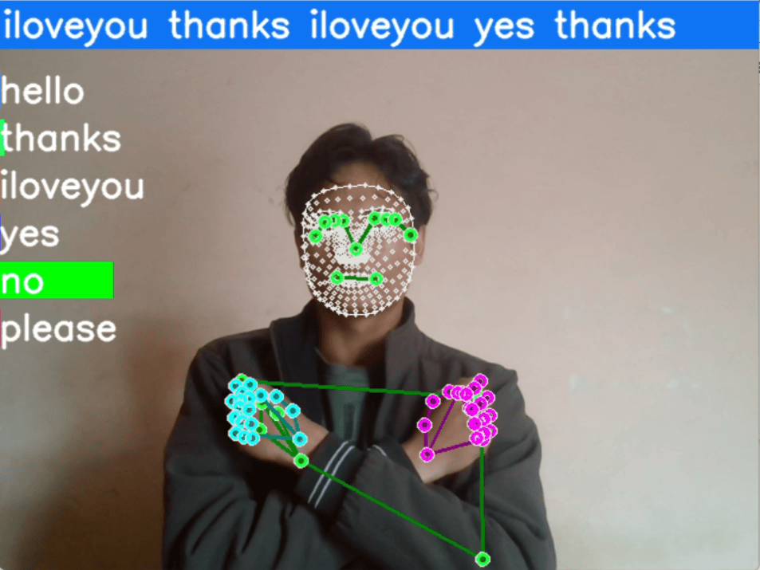

# 🤟 Real-Time Multi-Sign Recognition with LSTM & MediaPipe

A professional computer vision system that recognizes **6 distinct sign language gestures** in real-time. This project uses **Temporal Sequence Modeling** to interpret motion, going beyond simple static image classification.

---

## 📺 Project Showcase

 Real-time inference of 6 unique signs with live probability tracking.*

---

## ✨ Key Features
- **Temporal Sequence Processing:** Uses 30-frame windowing to understand the "flow" of a gesture.
- **Holistic Keypoint Tracking:** Tracks 1,662 landmarks across the face, hands, and body.
- **Real-Time Visualization:** Features a custom probability-bar overlay to show model confidence.

---

## 🧠 The Tech Stack

### 1. Keypoint Extraction (MediaPipe)
Instead of processing heavy pixels, we use **MediaPipe Holistic** to extract 3D coordinates. This ensures the model is lightweight and works in various lighting conditions.

### 2. The Dataset (6 Specific Signs)
The model was trained on a custom dataset of **180+ video sequences** (30 sequences per sign).
**Signs Included:**
1. **Hello** 👋
2. **Thanks** 🙏
3. **I Love You** 🤟
4. **Yes** ✅
5. **No** ❌
6. **Please** 🤲

### 3. Neural Network Architecture (LSTM)
To capture the motion over time, I built a 3-layer **LSTM (Long Short-Term Memory)** network:
- Layer 1: 64 Units
- Layer 2: 128 Units
- Layer 3: 64 Units
- Output: 6 Classes (Softmax Activation)

---

## 📁 Repository Structure
- `Sign_Language_Recognition.ipynb`: Complete code for data collection and training.
- `action.h5`: The trained LSTM model weights.
- `requirements.txt`: Necessary Python libraries.

---

## 🛠️ How to Run
1. Clone the repo: `git clone https://github.com/Sachinyadav0025/Sign-Language-Recognition-LSTM.git`
2. Install libraries: `pip install -r requirements.txt`
3. Run the "Real-time Detection" cell in the notebook.

---

## 👨‍💻 Connect with Me
- **LinkedIn:** https://www.linkedin.com/in/sachin-yadav-a31430348 
